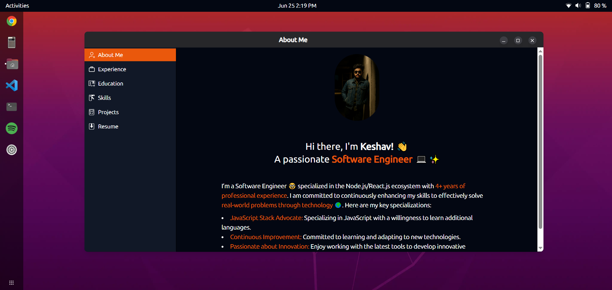

# Ubuntu Portfolio



A modern portfolio app inspired by the Ubuntu desktop environment. This app showcases your work, skills, and experience with an intuitive and visually appealing design.

### Live Demo:

[Check out the live version here!](https://keshav-ubuntu-portfolio.vercel.app/)

## ✨ Features

- **Ubuntu-inspired UI**: Mimics the look and feel of the Ubuntu operating system.
- **Dark mode theme**: Sleek and modern design.
- **Responsive**: Optimized for all screen sizes.
- **Interactive Navigation**: Sidebar with multiple sections for an immersive experience.
- **Customizable**: Easily update content to reflect your personal details.

## 🚀 Built With

- **[Next.js](https://nextjs.org/)** – React framework for server-side rendering and static site generation.
- **[TypeScript](https://www.typescriptlang.org/)** – Typed JavaScript for enhanced development.
- **[Tailwind CSS](https://tailwindcss.com/)** – Utility-first CSS framework for styling.
- **[Vercel](https://vercel.com/)** – For deployment and hosting.

## 📸 Preview


## 🛠️ Getting Started

### Prerequisites

Ensure you have the following installed:

- Node.js (v18.x or higher)
- npm

### Installation

1. Clone the repository:

   ```bash
   git clone https://github.com/keshavjatt/Ubuntu-Portfolio
   cd ubuntu-portfolio
   ```

2. Install dependencies:

   ```bash
   npm install
   ```

3. Run the development server:

   ```bash
   npm run dev
   ```

4. Open your browser and navigate to:

   ```
   http://localhost:3000
   ```

### Building for Production

To generate a production build:

```bash
npm run build
```

This will create an optimized build in the `.next` folder. You can then run the following command to start the production server:

```bash
npm run start
```

## 🎨 Customization

To personalize this portfolio:

1. **Update content**: Edit the `data` folder to modify the About Me, Experience, Projects, and other sections.
2. **Change styling**: Modify the Tailwind CSS configuration or components to adjust the theme or layout.

## 🤝 Contributing

Contributions are welcome! If you have any improvements or bug fixes, please:

1. Fork this repository.
2. Create a new branch (`git checkout -b feature-branch`).
3. Commit your changes (`git commit -m 'Add some feature'`).
4. Push to the branch (`git push origin feature-branch`).
5. Open a pull request.

## 📄 License

This project is open-source and available under the [MIT License](LICENSE).

## 📧 Contact

Feel free to reach out to me if you have any questions or suggestions:

- **Portfolio**: [https://keshav-ubuntu-portfolio.vercel.app/](https://keshav-ubuntu-portfolio.vercel.app/)
- **Email**: [thecoder780@gmail.com](thecoder780@gmail.com])
- **GitHub**: [@keshavjatt](https://github.com/keshavjatt)
